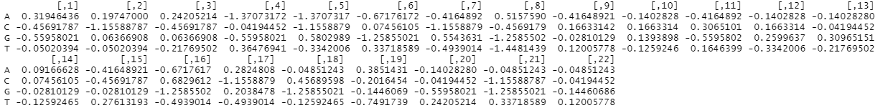
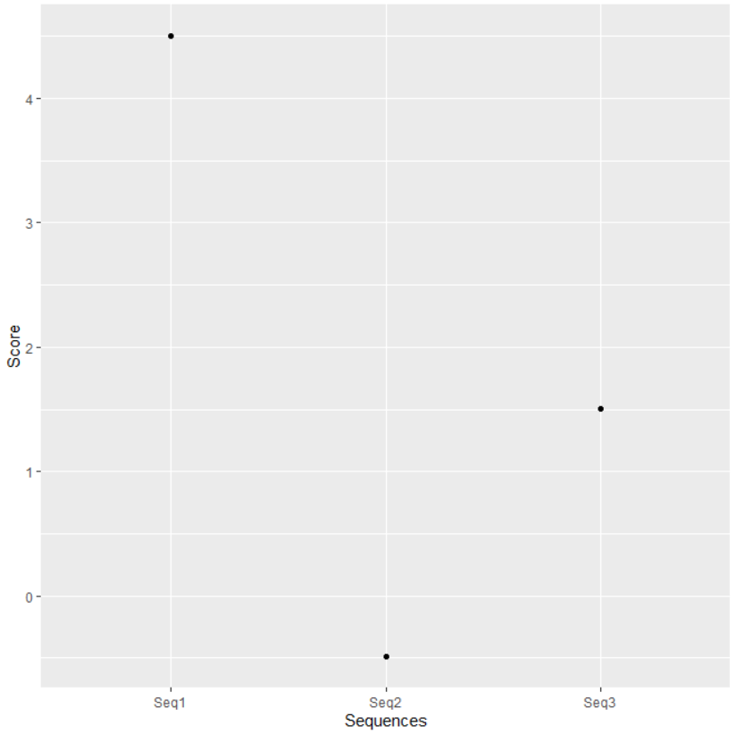

# BIO-410-Project

### Background
cAMP receptor protein (CRP) is a global transcription factor that in *Escherichia coli* regulates the expression of potentially 283 operons – which accounts for over 50% of all *E*. *coli* genes (Martı́nez-Antonio & Collado-Vides, 2003; Ishihama et al., 2016; Davis et al., 2017).  As a transcription factor that binds to a relatively large number of regulatory regions on genes, CRP binding sites on DNA can be particularly useful in gene detection. More specifically, structural annotation is the process of identifying genes within a genome (Tripp et al., 2015; Ejigu & and Jung, 2020). Typically, structural annotations utilize a position-specific score matrix (PSSM), where known DNA alignments are used to score unknown DNA sequences to determine the likelihood of a gene’s presence in that segment of DNA (Henikoff & Henikoff, 1996; Panchenko & Bryant, 2002). As a result, known CRP binding sites can be used to produce PSSMs to detect genes within genomes. 

Thus, this dataset utilizes known CRP binding sites in *E*. *coli* to generate a PSSM, which is then utilized to calculate the likelihood that three unknown DNA sequences are CRP binding sites. Sequences with a high likelihood of being a CRP binding site can then be investigated further to determine if a gene is present. 

### Methods
The libraries utilized in this project are: seqinr, Biostrings, rentrez, compbio4all, and ggplot2. All source code utilized to generate a PSSM and scores for the unknown DNA sequences can be viewed in the R file titled “StructuralAnnotationRMethod.R”. The known *E*. *coli* CRP binding sequences and unknown DNA sequences can both be found within this file. 

### Results

**Figure 1** Position-specific score matrix (PSSM) produced from known E. coli CRP binding sequences used to score unknown DNA sequences for their likelihood of being CRP binding sequences. 

**Figure 2** Likelihood score of each unknown DNA sequence being a CRP binding site. 

**Figure 1** depicts the final PSSM that was produced from the known CRP binding site DNA sequences in E. coli. This PSSM was used to score the three unknown DNA sequences in terms of their likelihood of being a CRP binding site, as shown in **Figure 2**. As this figure shows, Sequence 1 has the highest likelihood of being a CRP binding site, with a specific score of 4.506846. This is followed by Sequence 3, which has a likelihood score of 1.504502. Finally, Sequence 2 is unlikely to be a CRP binding site, as it has a negative likelihood score of -0.4891057. As a result, since CRP is global transcription factor for a ton of genes in the E. coli genome, it is most worthwhile to explore the presence of a gene near Sequence 1 followed by Sequence 3. Similarly, Sequence 2 has a low likelihood score of being a CRP binding site, and, thus, is the least likely to have a gene near it. 

### References
Davis, R., Écija‐Conesa, A., Gallego‐Jara, J., de Diego, T., Filippova, E. V., Kuffel, G., Anderson, W. F., Gibson, B. W., Schilling, B., Canovas, M., & Wolfe, A. J. (2017). An acetylatable lysine controls CRP function in E. coli. Molecular Microbiology, 107(1), 116–131. https://doi.org/10.1111/mmi.13874 

Ejigu, G. F., & Jung, J. (2020). Review on the computational genome annotation of sequences obtained by next-generation sequencing. Biology, 9(9), 295. https://doi.org/10.3390/biology9090295 

Henikoff, J. G., & Henikoff, S. (1996). Using substitution probabilities to improve position-specific scoring matrices. Bioinformatics, 12(2), 135–143. https://doi.org/10.1093/bioinformatics/12.2.135 

Ishihama, A., Shimada, T., & Yamazaki, Y. (2016). Transcription profile of escherichia coli: Genomic SELEX search for regulatory targets of transcription factors. Nucleic Acids Research, 44(5), 2058–2074. https://doi.org/10.1093/nar/gkw051 

Martı́nez-Antonio, A., & Collado-Vides, J. (2003). Identifying global regulators in transcriptional regulatory networks in bacteria. Current Opinion in Microbiology, 6(5), 482–489. https://doi.org/10.1016/j.mib.2003.09.002 

Panchenko, A. R., & Bryant, S. H. (2002). A comparison of position‐specific score matrices based on sequence and structure alignments. Protein Science, 11(2), 361–370. https://doi.org/10.1110/ps.19902 

Tripp, H. J., Sutton, G., White, O., Wortman, J., Pati, A., Mikhailova, N., Ovchinnikova, G., Payne, S. H., Kyrpides, N. C., & Ivanova, N. (2015). Toward a standard in structural genome annotation for prokaryotes. Standards in Genomic Sciences, 10(1). https://doi.org/10.1186/s40793-015-0034-9 

